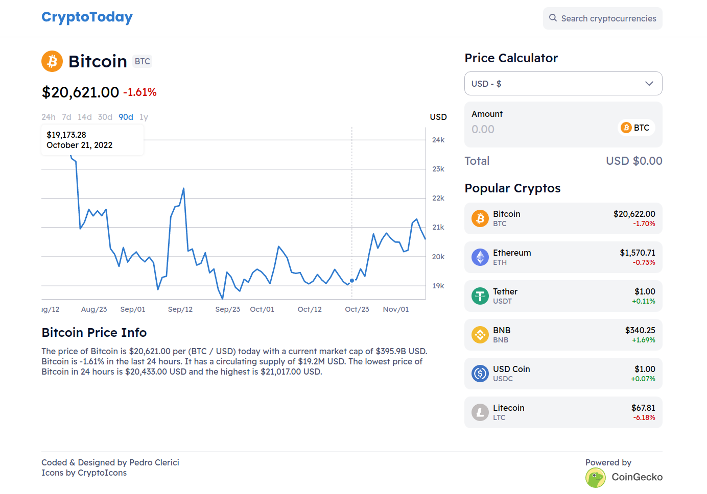

# CryptoToday


## Table of Contents
* [Project Purpose](#project-purpose)
* [Features](#features)
* [Getting Started](#getting-started)
* [Credits](#credits)

## Project Purpose
The purpose of this project is to improve my knowledge of react and APIs while building
a useful and interactive crypto price tracker.

## Features
* Historical interactive price chart.
* Currency selection.
* Mobile and desktop responsive.
* More than 50+ cryptocurrencies.

## Getting Started
You can see it live [here](https://pedroclerici.github.io/cryptotoday/)
or you can clone it to your machine and do the fallowing:

```bash
git clone https://github.com/PedroClerici/cryptotoday.git
```

```bash
npm install
```

```bash
npm start
```
## Credits
Thanks to [CoinGecko](https://www.coingecko.com/) for the API and [CryptoIcons](https://cryptoicons.co/) for the icons.